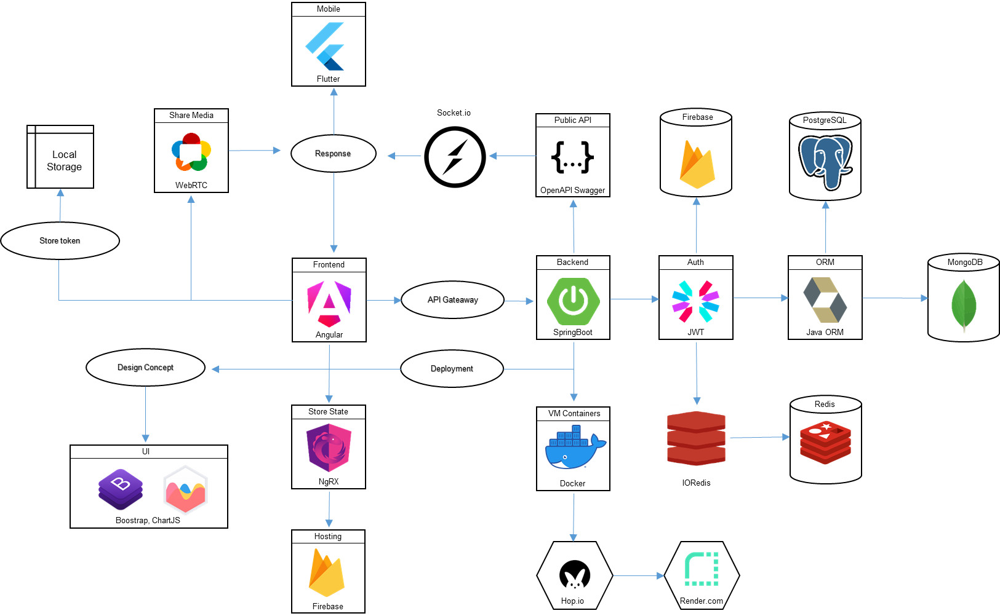
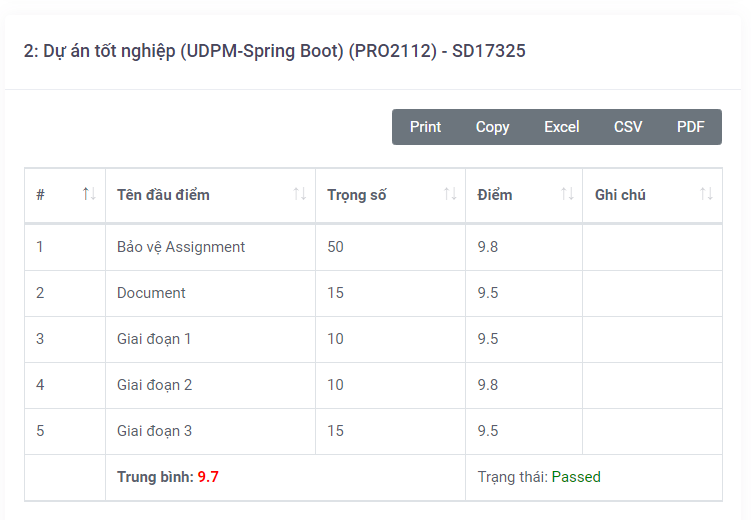
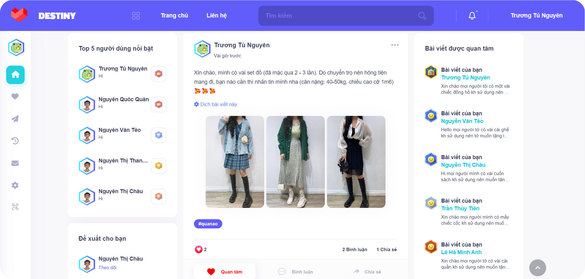
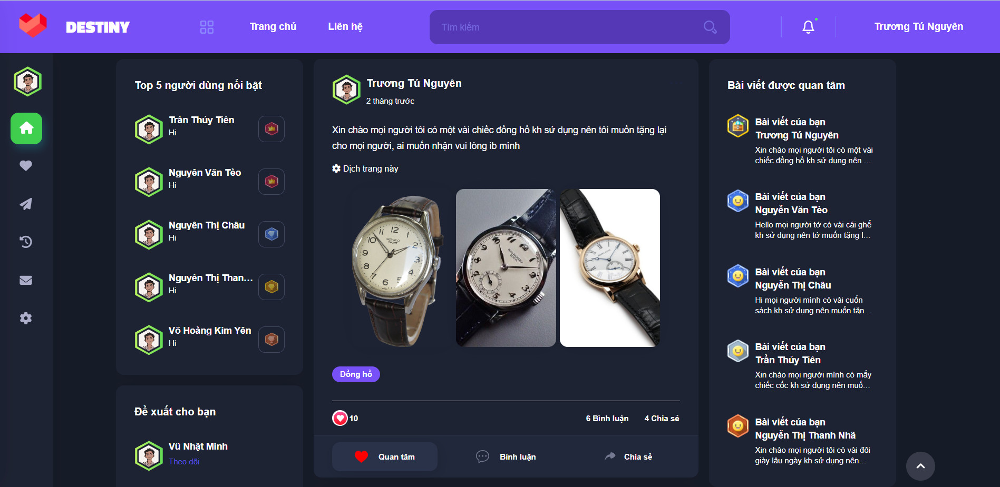
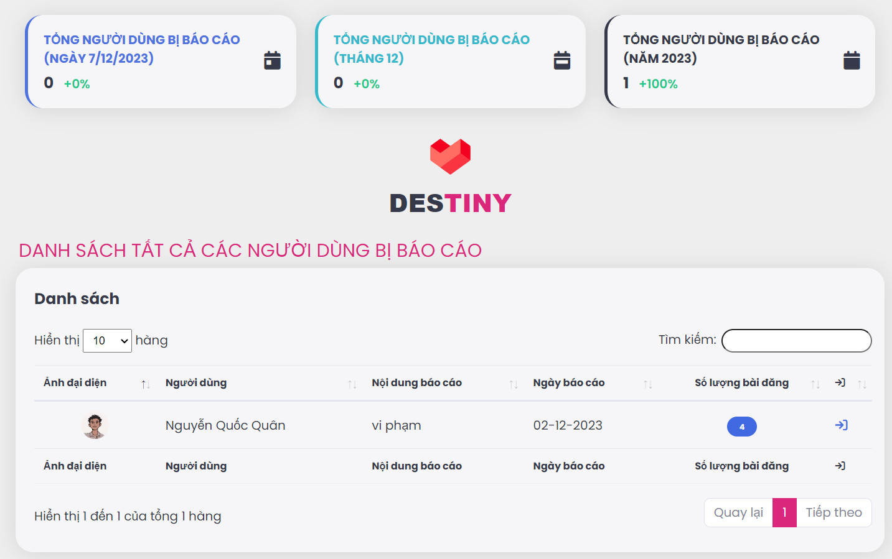
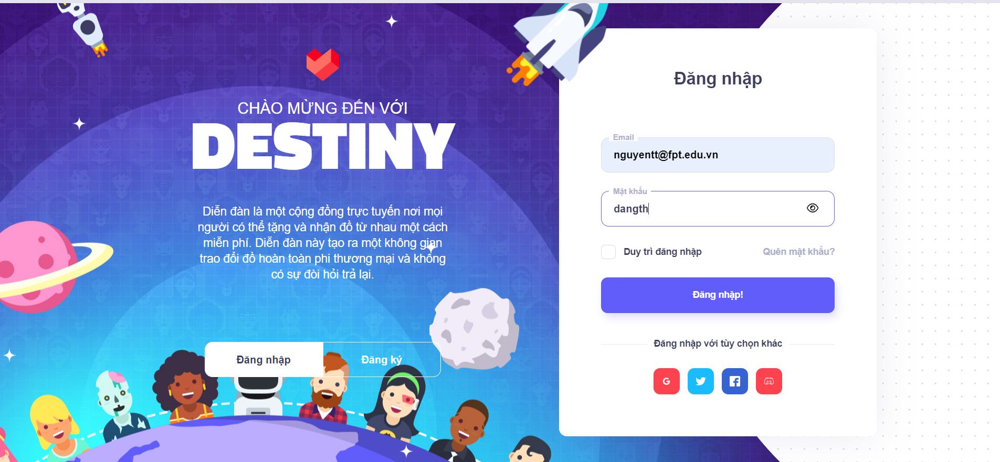
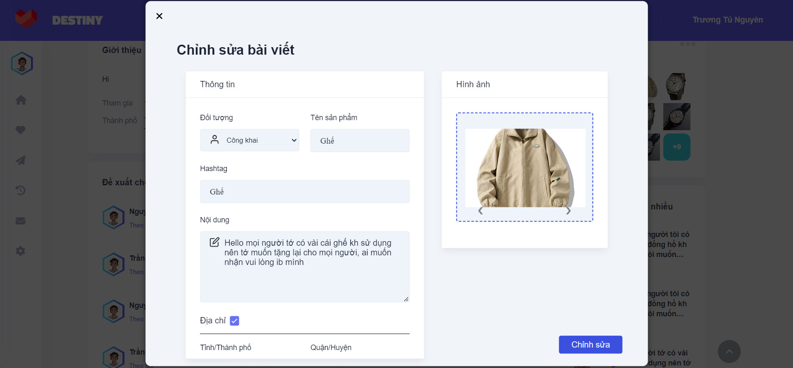
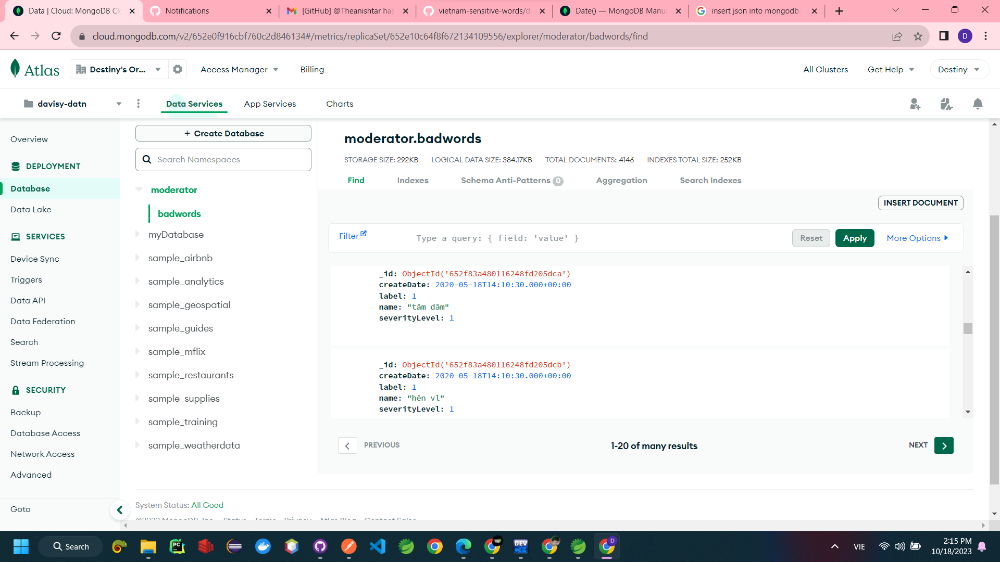
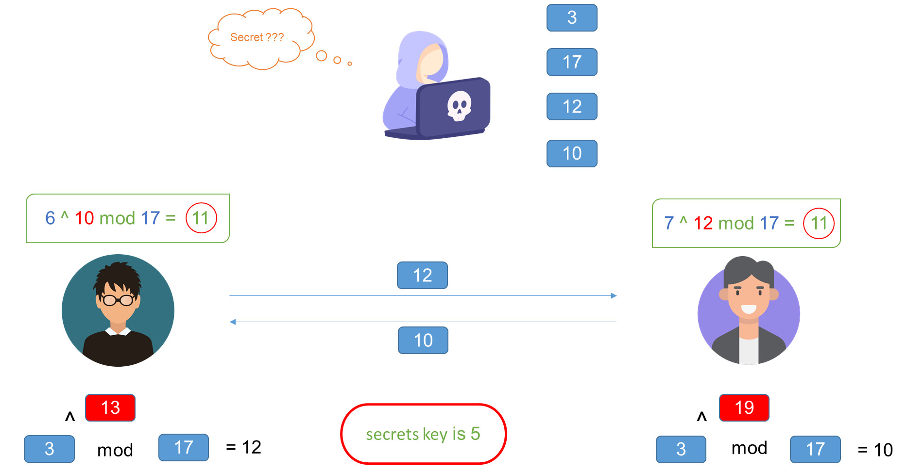

# Về dự án

Dự án của chúng tôi là một mạng xã hội Destiny!

URL công cộng: [desity-davisy.web.app](https://destiny-davisy.web.app) hoặc [destiny-poly.web.app](https://destiny-poly.web.app)

<!-- Dự án được hướng dẫn bởi thầy [Trần Văn Nhuôm](https://github.com/tvnhuom/) và sử dụng các công nghệ như: Java Spring Boot, Socket.io, Thymeleaf template engine, bootstrap 5, ... -->



## Người đóng góp
| Họ và Tên | Vai trò | Dự án nổi bật |
|-----------|------|--------------------|
|[Trần Hữu Đặng]() | Quản lý dự án, Phát triển Fullstack | [Chương trình Học Lập Trình Ebook](https://angurvad-5559e.web.app/)  
|[Đoàn Hiệp Sỹ]() | Phát triển BackEnd | [Quản lý Cửa hàng Xe đạp](https://github.com/DoanSy16/biker-shop-manager)  
|[Nguyễn Khánh Dân]() | Phát triển FrontEnd, BA | [FreshFood](https://github.com/NguyenKhanhDan/FreshFood)  
|[Phùng Quốc Vinh]() | Phát triển Fullstack | [Trò chơi Dodge](https://github.com/Dinhisme/DodgeGame)  
|[Lê Bích Vi]() | Phát triển FrontEnd | [Quản lí Kí túc xá](https://github.com/TheBank0911/Quanlikitucxa)

## Điểm số đạt được




## Về trang web 
Một trang web mạng xã hội để chia sẻ tình yêu và lòng nhân ái là một nền tảng trực tuyến được tạo ra với mục tiêu thúc đẩy tình yêu và lòng nhân ái trong cộng đồng trực tuyến. Trang web này cung cấp một không gian nơi mọi người có thể chia sẻ các hành động nhân ái, các câu chuyện ấm lòng và các hoạt động từ thiện.

Các tính năng và chức năng chính của trang web này có thể bao gồm:

1. **Tạo Hồ Sơ Cá Nhân**: Người dùng có thể đăng ký và tạo hồ sơ cá nhân của riêng họ để chia sẻ thông tin về bản thân, sở thích và các hoạt động từ thiện của họ.

2. **Bài Viết và Câu Chuyện**: Người dùng có thể tải lên bài viết, hình ảnh và video để chia sẻ các câu chuyện về tình yêu, nhân ái và các hành động thiện nguyện.

3. **Tương Tác Xã Hội**: Tích hợp các tính năng xã hội như bình luận, chia sẻ và thích để tạo điều kiện cho sự tương tác và kết nối giữa các thành viên.

4. **Sự Kiện Từ Thiện**: Cung cấp thông tin về các sự kiện từ thiện, các hoạt động nhóm và cơ hội tham gia vào các nỗ lực nhân đạo.

5. **Quyên Góp và Hỗ Trợ**: Cho phép người dùng quyên góp và hỗ trợ các dự án từ thiện và tổ chức phi lợi nhuận.

6. **Xây Dựng Cộng Đồng**: Xây dựng cộng đồng và nhóm trực tuyến để kết nối những người có cùng tư duy và nhiệm vụ từ thiện.

7. **Tạo Nền Tảng Tin Tưởng**: Tạo một môi trường trực tuyến tích cực thúc đẩy thông điệp về tình yêu, sự thông cảm và hỗ trợ tinh thần.

Trang web mạng xã hội để chia sẻ tình yêu và lòng nhân ái nhằm tạo ra một cộng đồng trực tuyến thúc đẩy sự đoàn kết và lan tỏa các giá trị tích cực trong xã hội. Nó khuyến khích mọi người thể hiện tình yêu và chia sẻ các câu chuyện ấm lòng để làm cho thế giới trở nên tốt đẹp hơn.

### Chức năng chính
- Đăng nhập, Đăng ký: Xác thực JWT, Google Cloude APIs, ...
- Tìm kiếm: Ajax
- Chat tin nhắn: Socket.io, StockJS
- Quản lý tài khoản: Spring Boot
- Vị trí cho bài đăng: [Cơ sở dữ liệu các tỉnh thành Việt Nam](https://github.com/dangtranhuu/vietnamese-provinces-database)

### Một số giao diện

<details>
  <summary>Giao diện chính (Lightmode)</summary>
  
  
</details>

<details>
  <summary>Giao diện chính (Darkmode)</summary>
  
  
</details>

<details>
  <summary>Giao diện chính (Admin & moderator)</summary>
  
  
</details>

<details>
  <summary>Giao diện đăng nhập</summary>

  
</details>

<details>
  <summary>Giao diện đăng bài</summary>

  
</details>


### Chức năng Nâng cao
- Gọi video (WebRTC, PeerJS) - <i>[đọc](https://github.com/theanishtar/video-call-webrtc)</i>


- Chặn yêu cầu spam (Redis) - <i>[đọc](https://github.com/theanishtar/spam-request-filter)</i>


- Chặn từ vi phạm trong bình luận (Redis & MongoDB) - <i>[đọc](https://github.com/theanishtar/vetonary)</i>


- Gửi tin nhắn (Văn bản và hình ảnh)
- Đăng nhập bằng mã QR (ứng dụng->web hoặc web->ứng dụng)


- Mã hoá tin nhắn đầu cuối bằng thuật toán Diffine Hellman và thuật toán mã hóa AES


- Tự động đăng nhập bằng cơ chế Interceptor của Angular và Refresh Token của JWT

#### Back-end (SpringBoot)
- Bảo vệ Đăng nhập bằng [Các APIs Firebase](https://console.firebase.google.com/u/1/project/davitickets-2e627/database/davitickets-2e627-default-rtdb/data/~2Flogin~2Fshield)
- Đăng nhập bằng GG [Clouds APIs]()
- Xác thực Json Web Token
- Bộ lọc ủy quyền Spring Security
- Máy tạo mã QR
- Xử lý lỗi nhãn trắng (401, 402, 404, 500, ...)

#### Front-end (Angular)
- Intercepter
- Bảo vệ
- Định tuyến
- Tin nhắn Toast
- Xác thực Form

#### Ứng dụng Di động (Flutter)

#### Cơ sở dữ liệu (PostgreSQL, MongoDB, Redis, Firebase)


## Kỹ thuật sử dụng

Spring Boot, Angular, Socket.io, JQuery, Bootstrap v5, Thymeleaf template angine.


<!-- ## Mục lục (tuỳ chọn)

- Yêu cầu
- Các module được đề xuất
- Cài đặt
- Cấu hình
- Xử lý sự cố
- Câu hỏi thường gặp
- Người duy trì -->

## Cài đặt và chạy dự án

- Sao chép repo
```bash
$ git clone https://github.com/Theanishtar/destiny
```
### Back-end: SpringBoot

- Cài đặt Spring Tools Suite 4 IDE [tại đây](https://spring.io/tools)

- Mở dự án 

- Chuột phải và Chạy dưới dạng Máy chủ

- Truy cập [http://localhost:8080/](http://localhost:8080/)

  
### Front-end: Angular

- Cài đặt VSCode
- Mở Dự án
- Kiểm soát bằng CMD hoặc GitBash
  
  ``` bash
  npm i
  ng serve
   ```
  
- Truy cập [http://localhost:4200/](http://localhost:4200/)
